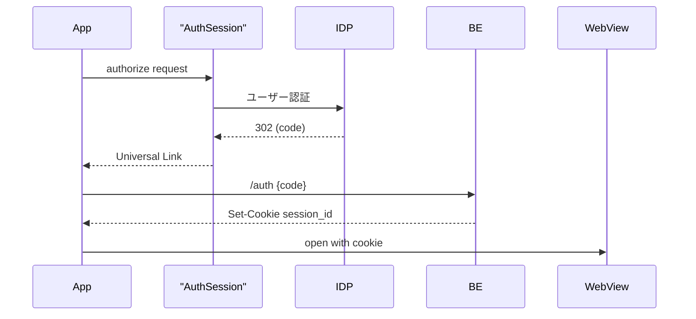

🚀 はじめに

モバイルアプリに OAuth 2.0 ログインを組み込むとき、「とりあえず WebView でログイン画面を開けばいいでしょ？」と考えがち。しかし実際には Cookie 共有・生体認証・Deep Link…課題が山盛りです。本稿では **ネイティブ＋ WebView** アプリを題材に、**AppAuth**（Flutter）で安全＆爆速に OAuth 2.0 を実装する手順を紹介します。

## 📚 WebView × OAuth2 の落とし穴

- **WebView ログインは基本 NG** ― RFC 8252 で非推奨
- **Cookie ストアが分離** ― WKWebView は Safari と別
- **リダイレクト受信が複雑** ― JS Bridge やポーリングが必要

> 解決策は 「認可コードはネイティブで、WebView にはセッションだけ渡す」 型！

## 🏗 アーキテクチャ



**ASWebAuthenticationSession／Chrome Custom Tabs** を使うだけでキーチェーン＋ Face ID 自動連携 👌

## 🔧 Flutter 実装

### 1️⃣ 依存

```yaml
dependencies:
  flutter_appauth: ^6.0.2
  uni_links: ^0.5.1
  webview_flutter: ^4.7.0
  webview_cookie_manager: ^2.0.1
```

### 2️⃣ 認可コード取得

```dart
dart
コピーする編集する
final auth = FlutterAppAuth();
final res = await auth.authorizeAndExchangeCode(
  AuthorizationTokenRequest(
    'DEMO_CLIENT', 'com.example.app:/oauth',
    serviceConfiguration: AuthorizationServiceConfiguration(
      authorizationEndpoint: 'https://idp.example.com/oauth/authorize',
      tokenEndpoint: 'https://idp.example.com/oauth/token',
    ),
    scopes: ['openid', 'profile'],
  ),
);
final accessToken = res.accessToken;

```

### 3️⃣ BE でセッション発行

```dart
dart
コピーする編集する
final r = await dio.post('/api/auth/oauth',
    data: {'access_token': accessToken});
final sessionId = r.data['session_id'];

```

### 4️⃣ WebView へ Cookie 注入

```dart
dart
コピーする編集する
await WebviewCookieManager().setCookies([
  Cookie('session_id', sessionId)
    ..domain = 'app.example.com'
    ..path = '/'
    ..secure = true
    ..httpOnly = true,
]);
Navigator.push(context, MaterialPageRoute(
  builder: (_) => const WebView(
        initialUrl: 'https://app.example.com/',
      ),
));

```

## 🔑 Deep Link 設定メモ（iOS / Android）

### iOS (Universal Link)

1. Xcode で **Associated Domains** を有効
2. `applinks:your.domain.com` を追加
3. `.well-known/apple-app-site-association` を配置（`/oauth*` を許可）

### Android (App Link)

`AndroidManifest.xml` に `intent-filter` を宣言し、

`assetlinks.json` をサーバに置いて検証ツールで確認。

💡 **ポイント**

- 可能なら _https_ の Universal/App Link を採用し、カスタムスキームは最小限に
- Flutter では `uni_links` で iOS/Android 共通コードで受信できる

## ⚔️ AppAuth と手作り実装の比較

|                          | AppAuth     | 手作り (HTTP + WebView) |
| ------------------------ | ----------- | ----------------------- |
| 認可 URL 生成            | ✅ 自動     | ⚠️ 手動で組立           |
| PKCE 対応                | ✅ 標準     | ❌ 自前実装             |
| AuthSession / CustomTabs | ✅ ラップ済 | ⚠️ プラグイン要         |
| 保守コスト               | 🔽 低       | 🔼 高                   |

## 🚀 ステージング用 IDP で先行開発するメリット

- **チームの手が止まらない**：ID 基盤完成を待たずクライアント側を完了
- **差し替え一瞬**：エンドポイントとクライアント ID を `.env` で切替
- **QA 前倒し**：再認可・refresh 失効などのエッジケースを早期検証

> 規格に乗っかる ＝ 最大の生産性ブースト 💪

## 🩹 よくあるハマり

| 症状               | 原因                                  |
| ------------------ | ------------------------------------- |
| ログインループ     | Cookie ドメイン or SameSite=None 抜け |
| iOS だけ未ログイン | Cookie 注入 →WebView 起動順が逆       |
| Face ID 出ない     | WKWebView で開いている                |

## 🎉 まとめ

- **AppAuth** なら ID プロバイダ非依存で認可コード取得
- コードはネイティブで受取り、**WebView には Cookie だけ** 渡すのが安全
- 生体認証・自動入力は OS が面倒を見る
- 仮 IDP で PoC → 本番基盤へ差し替えれば工数ゼロ

> この型を覚えれば次の案件でもコピペで爆速実装できますね 🚀
